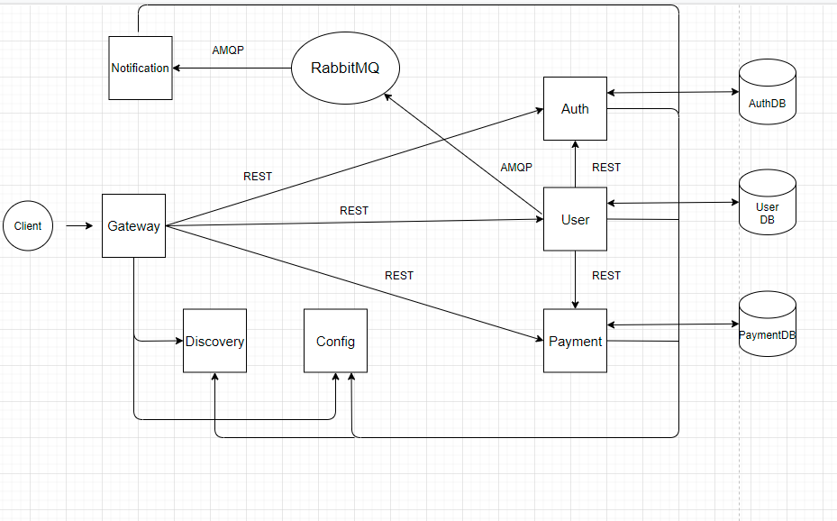

PAYMENT SYSTEM
=====================

### Author – Tatsiana Klasevich

***

### General information

Payment system is microservices project which allows customers to make payments, replenish their accounts, as well as
carry out money transfers. Card accounts can be default or not and have any status:  ENABLED, IS_BLOCKED, IS_CLOSED. If
the transaction has been successful the customer would receive the email.
***

### Stack

- JDK 11
- Spring Boot
- Spring Data
- Spring Security(Oauth2)
- Spring Cloud
- RabbitMQ
- Gradle
- Lombok
- MapStruct
- Flyway
- H2
- Docker

***

### Roles (CLIENT, BANK EMPLOYEE)

**CLIENT**

* create new card account
* update personal data
* view card account data
* make deposit, payment and transfer to another card account
* view transaction info

**BANK EMPLOYEE**

* view all users(CLIENT or BANK EMPLOYEE) page-by-page (sort by different parameters) or individually
* view all card accounts page-by-page (sort by different parameters) or individually
* view all transactions page-by-page (sort by different parameters) or individually
* add new user(CLIENT or BANK EMPLOYEE)
* delete users, card accounts and transactions

***

### Project bootstrap order

1) RabbitMQ run command:
   docker run -p 15672:15672 -p 5672:5672 rabbitmq:3-management
2) config-service -> ConfigApplication (run)
3) registry-service -> RegistryApplication (run)
4) gateway-service -> GatewayApplication (run)
5) auth-service -> AuthApplication (run)
6) user-service -> UserApplication (run)
7) payment-service -> PaymentApplication (run)
8) notification-service -> NotificationApplication (run)

***

### Scheme

